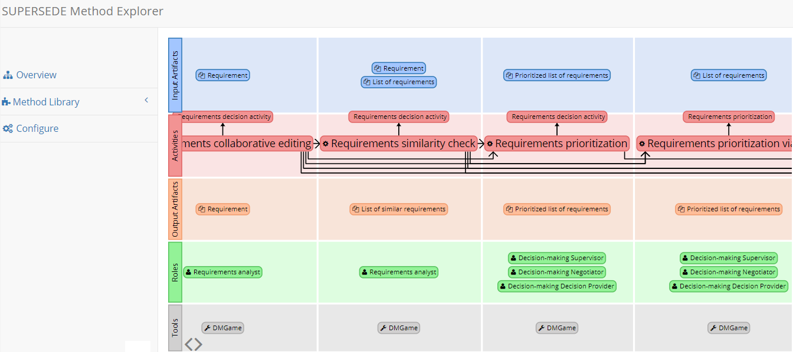

# method_explorer
A tool for exploring and configuring the Supersede Method.

# Input Data
All input data is specified as csv files in pages/data. 

## Activities, Roles, Tools, and Artifacts

Update these files by concatenating the exported csvs (take care that the last and first line of exported sheets don’t land in the same line).
It is mandatory that the each definition starts with ‘ID:’ and is followed by ‘Name:’, each following row/key-value is associated to the first ID: above it.
The order of rows is the same as in the webpage.

- The ‘Responsible’ field is always ignored, the ‘Mape-phase’ field is used to create the 4 categories and not displayed.
- Row values can contain newlines, commas and “.
- Hyperlinks are automatically detected, they must start with http:// or https:// and continue until the first blank character.
- Intersite Hyperlinks are created by the syntax <arbitrary hyperlinked text < ID>>, where ID must be a valid activity, role, tool or artifact ID.
Note; all styling information in the doc eg. italic, bold or colors are lost in the csv export.

## Criteria, criteriaGroups, criteriaValues 

These are the csv exports of the Criteria definitions, Criteria groups and Criteria values sheets respectively.

### Criteria Groups
The order and number of criteria groups corresponds to the pages displayed, and their description can contain arbitrary html tags (there is no automatic hyperlink and intersite hyperlink support).

### Criteria
- The criteria (definitions) can be comboboxes or checkboxes chosen via Multi-select.
- The values of the Criteria Group column must match the Criteria Group names.
- Similarly the Criteria values must match the columns in the ‘Criteria values’ sheet.
- The values column specifies the order the choices are displayed in (unspecified values here are added at the end randomly)
- Like the Criteria group descriptions, Criteria group Explanation can contain arbitrary html tags.

### Criteria Values
- The criteria values, specify the actual constraints for each activity (not role,tool,..) to be displayed.
- Activities marked as “Manualizable” are prefixed with Manual in the visualization instead of removed (and therefore are always in the generated pdf).
- Empty fields signify any criteria value is fine, multiple values signify any of these must be true.
- The Name, Type and WP columns are ignored.

You can safely modify the number of any these, but take care about the referential integrity/ primary-foreign-key interconnectivity that exists between these sheets.

## Edges

Edges.csv is the only file that can not be easily exported and has to be maintained manually.

This data is relevant for the visualization, the visualization does NOT care about the content of e.g. “Related Artifacts:” or “Roles involved:”.

- The visualization supports 5 edge types, and the file content should be read as: 
  make and edge from ‘from’ to ‘to’ with the label ‘type’. 
- The supported edge types are: input, output, role, tool, inherit, and require.
- An unsupported edge type is ignored by the application.

The information of edges.csv is also displayed in the tables found in the pdf.

## csv parser
You can maintain the csv files without google docs/export and the csv parser was written to be relatively tolerant csv files.
the parser can deal with;
- variable number of columns
- mixing of quoted and unquoted cells (" is escaped by "")
- newlines in quoted cells
- the seperator is guessed for input files with a starting ID: or ID element (this was done to allow the parser to (largely) work with the locale dependant csv exporter of MS Excel)

## Stylesheet 
The not size changing properties of the elements in the visualization can be freely modified in style.css

The visualization supports changing the fonts, font sizes, stroke-width and margins of elements, on a activity/role/tool/artifact level. 

Other size changing properties may work, but the visualization layouting may not be aware of them creating odd results (e.g. a stylesheet set padding for svg elements is not properly inherited in all browsers). So changing these will require testing across different browser.

Changing colors is fine.

## PDF Generation
Hyperlinks are automatically detected (site interlinks are disarmed/removed).

The idea is that what is seen in the visualization ends up in the pdf, meaning manualizeable activitities are always in the pdf (maybe there is a switch desired to display a different text).

The texts of Tailored Method entries are the appended values of the corresponding csv entries in this order:
    "Description:"
    "Context:"
    "Situation:"

The texts for Tool Setup Guidelines are the appended values of the corresponding csv entries in this order:
    "Configuration instructions:"
    "Description of use:"

